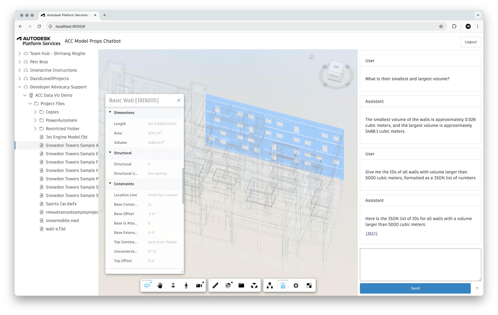

# ACC Model Properties Assistant

Experimental chatbot for querying design data in [Autodesk Construction Cloud](https://construction.autodesk.com/) using custom [LangChain](https://www.langchain.com) agents and [Autodesk Platform Services](https://aps.autodesk.com) ([ACC Model Properties API](https://aps.autodesk.com/en/docs/acc/v1/tutorials/model-properties/)).

## How does it work?

The application implements a [LangGraph agent](https://python.langchain.com/docs/how_to/migrate_agent/) with a couple of custom tools that let it talk to the [ACC Model Properties API](https://aps.autodesk.com/en/docs/acc/v1/tutorials/model-properties/), and process JSON responses using [jq](https://jqlang.org/). The agent is also provided with a short guide explaining the syntax of the Model Properties Query Language (see [MPQL.md](./MPQL.md)).

After logging in an selecting a design, the user can start sending prompts to the agent. The agent will execute different types of tasks based on the user's prompt, for example:

- Create a new index using the Model Properties API
- Retrieve list of available index fields
- Generate and execute custom queries over the index
- Process JSON results using custom jq queries

## Usage

Login with your Autodesk credentials, select one of your design files in ACC, and try some of the prompts below:

> how many walls are there?

> what is the smallest and the largest volume of a wall?

> list the IDs of walls with volume larger than 1000.0 cubic meters

## Development

### Prerequisites

- [APS application](https://aps.autodesk.com/en/docs/oauth/v2/tutorials/create-app/) of the _Desktop, Mobile, Single-Page App_ type
- [OpenAI API key](https://platform.openai.com/docs/quickstart/create-and-export-an-api-key)

### Setup

- Clone the repository
- Initialize and activate a virtual environment: `python3 -m venv .venv && source .venv/bin/activate`
- Install Python dependencies: `pip install -r requirements.txt`
- Update [static/config.js](static/config.js) with your APS client ID and callback URL
- Set the following environment variables:
  - `OPENAI_API_KEY` - your OpenAI API key
- Run the dev server: `python server.py`
- Open http://localhost:8000 in the browser